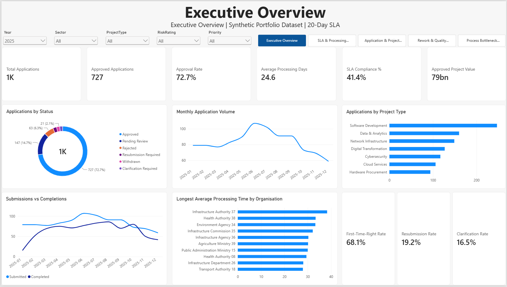
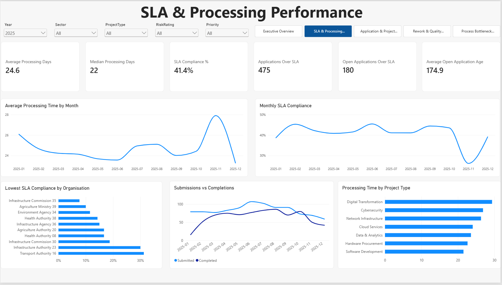
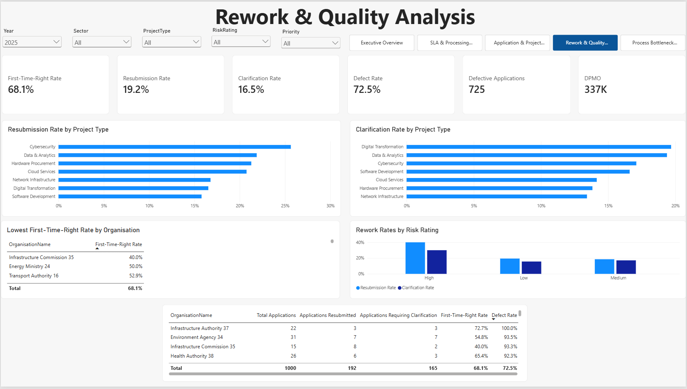
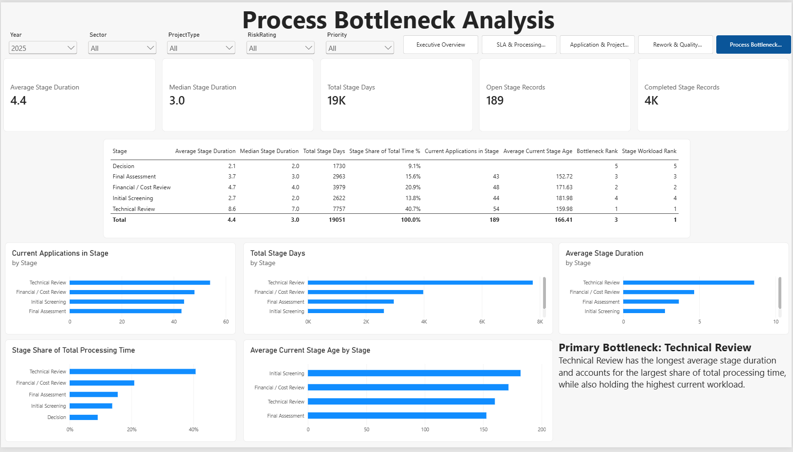

# IT Project Clearance & Service Performance Analytics

A portfolio-grade Power BI project focused on service performance, SLA monitoring, project portfolio analysis, process quality, rework, and workflow bottleneck identification.

The solution analyses a synthetic portfolio of **1,000 IT project applications** using Power BI, Power Query, DAX, dimensional modelling, time intelligence, and process-improvement metrics.

> **Data Note:** All data used in this project is fully synthetic and fictional. No confidential, proprietary, applicant, financial, government, or operational data from any real organisation is included.

---

## Project Overview

IT project clearance and approval processes can involve multiple review stages, clarification requests, resubmissions, SLA requirements, project-value considerations, and significant operational complexity.

This project was designed to build an end-to-end Power BI analytics solution capable of answering questions such as:

- How many applications are being submitted and approved?
- What proportion of applications meet the target SLA?
- How long does the average application take to process?
- Which project types experience the longest processing times?
- Which organisations experience the lowest SLA compliance?
- How frequently are applications resubmitted?
- How often is clarification required?
- What proportion of applications are processed correctly the first time?
- Where are open applications accumulating?
- Which workflow stage represents the primary process bottleneck?
- How much proposed project value is represented across the portfolio?
- Which sectors and project types account for the largest application volumes and project values?
- How do risk, priority, and project type relate to processing and quality performance?

The final Power BI solution contains five interactive analytical pages:

1. Executive Overview
2. SLA & Processing Performance
3. Application & Project Analysis
4. Rework & Quality Analysis
5. Process Bottleneck Analysis

---

## Key Project Features

The project demonstrates:

- Power BI semantic modelling
- Power Query data preparation
- Dimensional modelling
- Fact and dimension table design
- One-to-many relationships
- Active and inactive date relationships
- DAX measure development
- Time intelligence
- SLA analysis
- Backlog and ageing analysis
- Process-quality metrics
- Defect and DPMO analysis
- Workflow bottleneck identification
- Interactive slicers
- Synced filters across report pages
- Page navigation
- Executive dashboard design
- Operational performance analysis

---

## Dashboard Pages

### 1. Executive Overview

The Executive Overview provides a high-level management view of overall portfolio and service performance.

Key indicators include:

- Total Applications
- Approved Applications
- Approval Rate
- Average Processing Days
- SLA Compliance %
- Approved Project Value
- First-Time-Right Rate
- Resubmission Rate
- Clarification Rate

Supporting visuals include:

- Applications by Status
- Monthly Application Volume
- Applications by Project Type
- Submissions vs Completions
- Organisations with the longest average processing times
- Quality indicators

The page is designed to provide an at-a-glance summary of workload, outcomes, operational performance, and process quality.

---

### 2. SLA & Processing Performance

This page focuses on service performance, turnaround time, SLA compliance, backlog, and processing trends.

Key measures include:

- Average Processing Days
- Median Processing Days
- Applications Within SLA
- Applications Over SLA
- SLA Compliance %
- Open Applications Over SLA
- Average Open Application Age
- Applications Approaching SLA
- Open Applications 30+ Days
- Open Applications 45+ Days

The page also analyses:

- Average Processing Time by Month
- Monthly SLA Compliance
- Processing Time by Project Type
- Lowest SLA Compliance by Organisation
- Submissions vs Completions

This provides both historical and current-state visibility into service performance.

---

### 3. Application & Project Analysis

This page explores the composition and financial characteristics of the application portfolio.

Key indicators include:

- Total Applications
- Total Project Value
- Average Project Value
- Approved Project Value
- Approval Rate

Supporting analysis includes:

- Application Volume by Project Type
- Project Value by Project Type
- Applications by Sector
- Project Value by Sector
- Applications by Risk Rating
- Applications by Priority
- Average Project Value by Risk Rating
- Organisation-level performance table

This page helps distinguish between workload volume and financial significance across the portfolio.

---

### 4. Rework & Quality Analysis

This page focuses on process quality and the amount of avoidable rework within the application lifecycle.

Key measures include:

- First-Time-Right Rate
- Resubmission Rate
- Clarification Rate
- Defective Applications
- Defect Rate
- Multiple Resubmission Rate
- Average Resubmissions
- Defects Per Opportunity
- Defects Per Million Opportunities (DPMO)

Supporting analysis includes:

- Resubmission Rate by Project Type
- Clarification Rate by Project Type
- Lowest First-Time-Right Rate by Organisation
- Rework Rates by Risk Rating
- Organisation-level quality performance

An application is considered **First-Time-Right** when it requires neither resubmission nor clarification.

For quality analysis, three defect opportunities are defined:

1. Resubmission
2. Clarification requirement
3. SLA breach

This allows DPMO to be calculated using explicit defect opportunities rather than simply converting an application-level defect rate.

---

### 5. Process Bottleneck Analysis

This page analyses the workflow at individual process-stage level.

The workflow contains five stages:

1. Initial Screening
2. Technical Review
3. Financial / Cost Review
4. Final Assessment
5. Decision

Key measures include:

- Average Stage Duration
- Median Stage Duration
- Total Stage Days
- Stage Share of Total Processing Time
- Current Applications in Stage
- Average Current Stage Age
- Bottleneck Rank
- Stage Workload Rank

The analysis identifies **Technical Review** as the primary process bottleneck in the synthetic portfolio.

Approximate Technical Review metrics include:

- **8.6 days** average stage duration
- **7 days** median stage duration
- **7,757 total stage days**
- **40.7%** of total recorded stage time
- **54 current applications**
- **Bottleneck Rank: 1**
- **Stage Workload Rank: 1**

This demonstrates how Power BI can be used not only for descriptive reporting but also for operational process diagnosis.

---

## Data Model

The project uses a dimensional model with application-level and workflow-stage-level fact tables.

### Fact Tables

#### FactApplications

**Grain:** One row per IT project application.

Key fields include:

- ApplicationID
- OrganisationID
- ProjectTypeID
- SubmissionDate
- ReviewStartDate
- CompletionDate
- StatusID
- ProjectValue
- ResubmissionCount
- ClarificationRequired
- Priority
- RiskRating

#### FactProcessStages

**Grain:** One row per application process-stage record.

Key fields include:

- StageRecordID
- ApplicationID
- Stage
- StageStartDate
- StageEndDate
- StageSequence

---

### Dimension Tables

#### DimOrganisation

Contains:

- OrganisationID
- OrganisationName
- OrganisationType
- Sector
- Region

#### DimProjectType

Contains:

- ProjectTypeID
- ProjectType
- Category

#### DimApplicationStatus

Contains:

- StatusID
- Status
- StatusGroup

#### DimDate

Contains:

- Date
- Year
- Month Number
- Month Name
- Month Short
- Year Month
- Year Month Sort
- Quarter
- Day
- Day Name
- Weekday Number

---

## Model Relationships

The model uses predominantly one-to-many relationships.

```text
DimOrganisation
      1
      |
      *
FactApplications
      |
      1
      |
      *
FactProcessStages
```

Additional relationships include:

```text
DimProjectType        1 ─── * FactApplications
DimApplicationStatus  1 ─── * FactApplications
```

The date dimension connects to `FactApplications` through three date relationships:

```text
DimDate[Date] 1 ─── * FactApplications[SubmissionDate]
```

This is the active relationship.

Inactive relationships connect `DimDate` to:

- ReviewStartDate
- CompletionDate

These are activated in specific DAX measures using `USERELATIONSHIP()`.

---

## Time Intelligence

The project includes time-intelligence measures such as:

- Applications Submitted
- Applications Submitted Previous Month
- Applications MoM Change
- Applications MoM Change %
- Applications Submitted YTD
- Applications Completed by Completion Date
- Applications Completed Previous Month
- Completions MoM Change %
- Applications Completed YTD
- Reviews Started

Using inactive relationships allows submission activity, review-start activity, and completion activity to be analysed independently through the same calendar dimension.

---

## SLA Methodology

The initial dashboard uses a:

**20-calendar-day SLA**

For completed applications:

```text
Processing Time =
Completion Date - Submission Date
```

Applications completed within 20 days are considered within SLA.

```text
Within SLA:
Processing Days <= 20
```

```text
Over SLA:
Processing Days > 20
```

For open applications, a fixed reporting date is used:

```text
31 December 2025
```

This prevents the synthetic dataset from becoming artificially older as the real-world date changes.

Open application age is calculated as:

```text
Reporting Date - Submission Date
```

An application is considered to be approaching SLA when:

```text
15 <= Application Age <= 20 days
```

Additional backlog measures track applications aged:

- 30+ days
- 45+ days

---

## Process Quality Methodology

### First-Time-Right

An application is considered First-Time-Right when:

```text
ResubmissionCount = 0
AND
ClarificationRequired = FALSE
```

### Defective Application

An application is classified as defective when at least one of the following occurs:

- Resubmission
- Clarification requirement
- SLA breach

### Defect Opportunities

Each application has three defined defect opportunities:

1. Resubmission
2. Clarification
3. SLA compliance

This enables the calculation of:

```text
Total Defect Opportunities =
Total Applications × 3
```

### Defects Per Opportunity

```text
Total Defect Occurrences
÷
Total Defect Opportunities
```

### DPMO

```text
Defects Per Opportunity
×
1,000,000
```

This approach distinguishes between:

- Defective Applications
- Defect Occurrences
- Defect Opportunities

and provides a more transparent quality-analysis methodology.

---

## Key Findings

At the default reporting context, the synthetic portfolio produces approximately:

| Metric | Value |
|---|---:|
| Total Applications | 1,000 |
| Approved Applications | 727 |
| Approval Rate | 72.7% |
| Completed Applications | 811 |
| Average Processing Days | 24.6 |
| Median Processing Days | 22 |
| Applications Within SLA | 336 |
| Applications Over SLA | 475 |
| SLA Compliance % | 41.4% |
| Applications Resubmitted | 192 |
| Resubmission Rate | 19.2% |
| Applications Requiring Clarification | 165 |
| Clarification Rate | 16.5% |
| First-Time-Right Rate | 68.1% |
| Defective Applications | 725 |
| Defect Rate | 72.5% |
| DPMO | ~337K |

The most significant process finding is that **Technical Review is the primary workflow bottleneck**, contributing approximately **40.7% of total stage processing time**.

---

## Interactive Features

The report includes synchronized slicers for:

- Year
- Sector
- Project Type
- Risk Rating
- Priority

### Default Filter State

```text
Year = 2025
Sector = All
Project Type = All
Risk Rating = All
Priority = All
```

These filters allow users to dynamically analyse different subsets of the portfolio across the report.

A page navigator provides movement between the five primary analytical pages.

---

## Tools & Technologies

- Power BI Desktop
- Power Query
- DAX
- Dimensional Modelling
- Star Schema Design
- Time Intelligence
- Data Quality Analysis
- SLA Performance Analytics
- Process Bottleneck Analysis
- Process Improvement Metrics
- DPMO / Defect Analysis
- Interactive Report Design

---

## DAX Concepts Demonstrated

The project uses DAX functions and concepts including:

- `COUNTROWS`
- `CALCULATE`
- `FILTER`
- `DIVIDE`
- `SUM`
- `AVERAGE`
- `AVERAGEX`
- `MEDIANX`
- `DATEDIFF`
- `RANKX`
- `DATEADD`
- `TOTALYTD`
- `USERELATIONSHIP`
- `ALL`
- `ISBLANK`
- `COALESCE`
- Variables using `VAR` and `RETURN`

---

## Skills Demonstrated

This project demonstrates practical experience in:

- Building Power BI semantic models
- Designing fact and dimension tables
- Defining table grain
- Creating one-to-many relationships
- Managing active and inactive date relationships
- Writing reusable DAX measures
- Implementing time intelligence
- Creating operational KPIs
- SLA monitoring
- Backlog and ageing analysis
- Process-quality measurement
- Defect and DPMO analysis
- Workflow bottleneck identification
- Executive dashboard design
- Interactive filtering
- Synced slicers
- Page navigation
- Translating operational data into management insights

---

## Repository Structure

```text
IT-Project-Clearance-Analytics/
│
├── README.md
│
├── data/
│   ├── FactApplications.csv
│   ├── FactProcessStages.csv
│   ├── DimOrganisation.csv
│   ├── DimProjectType.csv
│   └── DimApplicationStatus.csv
│
├── powerbi/
│   └── IT_Project_Clearance_Analytics.pbix
│
├── screenshots/
│   ├── 01_Executive_Overview.png
│   ├── 02_SLA_Processing.png
│   ├── 03_Application_Project_Analysis.png
│   ├── 04_Rework_Quality.png
│   └── 05_Process_Bottleneck.png
│
└── documentation/
    └── data_dictionary.md
```

---

## Dataset

The synthetic dataset contains:

- 1,000 applications
- 40 fictional organisations
- 7 project types
- 6 application statuses
- 4,523 process-stage records
- 5 workflow stages

Intentional relationships were introduced into the synthetic data so that the dashboard contains realistic patterns in:

- Processing delays
- SLA performance
- Application complexity
- Project value
- Risk
- Resubmissions
- Clarification requirements
- Organisation performance
- Workflow-stage duration

This creates a more realistic analytical environment than a purely random dataset.

---

## Screenshots

### Executive Overview



### SLA & Processing Performance



### Application & Project Analysis


### Rework & Quality Analysis



### Process Bottleneck Analysis



---

## Future Enhancements

Potential future improvements include:

- Working-day SLA calculations instead of calendar days
- Public-holiday calendar
- Dynamic reporting-date parameter
- Dynamic SLA target parameter
- Reviewer/team dimension
- Stage-owner analysis
- Rework reason codes
- Clarification reason codes
- Drill-through to individual application records
- Dedicated report-page tooltips
- Dynamic bottleneck narrative using DAX
- What-if analysis for alternative SLA targets
- Automated data refresh
- Power BI Service deployment
- Row-level security
- Incremental refresh
- Process-stage forecasting

---

## Disclaimer

This project was created for portfolio and learning purposes.

All organisations, project applications, project values, workflow records, quality outcomes, processing times, and performance patterns are synthetic and fictional.

The project does not contain confidential, proprietary, operational, applicant, or financial data from any real organisation.
